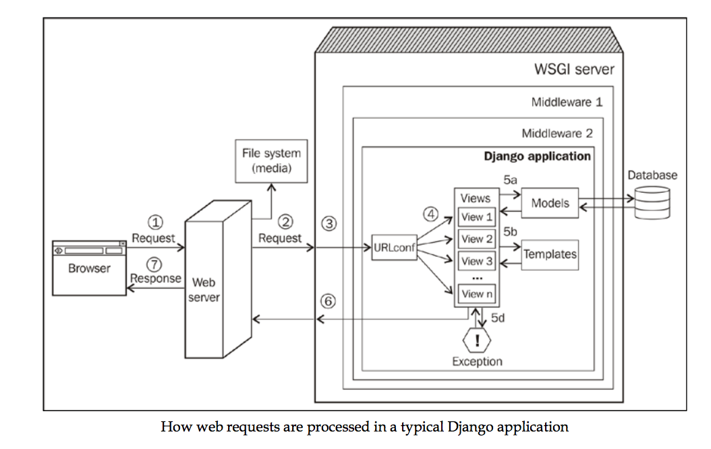

#第一章 Django和模式

这一章节我们将会讨论以下主题：

- 为什么选择Django？
- Django的前世今生
- Django是如何工作的
- 模式是什么？
- 著名的模式有哪些
- Django的模式

Bowei Gai的“世界创业公司报告”显示，2013年全世界有超过136000家互联网公司，而其中仅在美国的就有超过60000家。在这些公司中，有87家美国公司估值超过了十亿美元。另一项研究表明，在来自27个国家里18到30岁之间的12000人之中，有三分之二的人都觉得有机会成为企业家。

这一股数码行业里的创业风产生的主要原因之一是创业公司需要的工具和技术开始逐渐变得廉价和普遍。得益于各种威力强大的框架，现在创建一套完整的Web应用比以前需要的时间大大减少。

即使对于编程初学者，学会创建一个Web应用的学习曲线也非常的平滑。然而，很快他们就不得不持续地解决别人已经遇到并解决过的问题。理解“模式”正是为了帮助我们在这一点上节约更多的时间。

##为什么选择Django

每一个Web应用都像一件手工家具一样是与众不同的。你很难找到一个量产的应用可以完美满足你的所有需求。即使你从最简单的需求开始，比如一个博客系统或者是一个社交网络系统，你的需求仍然会缓慢增长，直到一个原本很简单的方案被修补得面目全非。

这就是为什么像Django或者Rails这样的Web框架变得如此流行。框架可以加速整个开发进程，并且它们已经整合了非常多的最佳实践。与此同时，它们也灵活到你可以只操作你所需要的部分。现如今，Web框架十分普遍，几乎所有的语言都至少有一个类似Django的端到端框架。

Python拥有的Web框架也许比大多数的编程语言都多。在[PyPi](https://pypi.python.org/pypi)上大致扫一眼就可以看到惊人的13021个与框架相关的包。与Django相关的一共有5467个。

Python维基所列出的包含了54个活跃Web框架的列表里，Django，Flask， Pyramid和Zope是最流行的。Python里的Web框架类型也非常的广泛。压缩过的微Web框架Bottle仅仅包含一个Python文件，并且不需要任何的依赖包就可以创建一个简单的Web应用。

尽管有着如此多的选择，Django仍然成为了大众偏爱的选择。Djangosites.org上列出了超过4700个使用Django开发的网站，其中不乏非常出名的成功例子，比如Instagram， Pinterest和Disqus。

正如[Django官方文档](https://djangoproject.com)所述，Django是用Python开发的高层Web框架，旨在对快速开发和干净务实的程序设计提供支持。换句话说，这是一个自带能源的完整的Web框架，就跟Python一样。

Django独一无二的特性，极具创意的admin接口对于早期的数据管理和测试帮助极大。Django作为一个开源项目，其优雅详尽的文档也备受赞誉。

Django也是在很多高流量网站上经历过实战考验的。而且它非常注重安全问题。对于常见网络攻击，比如Cross-site scripting(XSS)和Cross-site request forgery(CSRF)，Django非常注重防范。

尽管理论上说，你可以用Django开发任何Web应用，但是它并不一定总是最正确的选择。比如你想要开发一个基于Web的实时聊天界面，Tornado也许更好，不过整个Web应用别的部分仍然可以用Django开发完成。记得选择最正确的工具。

如果你习惯了别的Web框架，那Django一些内置的特性，比如admin界面可能会让你觉得很奇怪。为了理解Django的设计，让我们来看看Django的前世今生吧。

##Django的前世今生

当你仰望埃及金字塔的时候，你可能会觉得这么简单的设计来的非常容易吧。事实上，它们是4000年建筑学进化的结晶。纵观金字塔的设计，最原始(也很笨重）的设计是用六个尺寸递减的方砖堆砌。经过了建筑学和工程学的数次发展才最终发明并使用了更现代，更明亮，也能持续更长时间的石灰岩结构。

在阅读Django的时候，你也许会有同样的感觉。既然它现在如此的优雅，那当初的设计也一定是完美无瑕的吧。恰恰相反，它实际上是不断改写，极速迭代开发的产物。并且是在几乎最高压的环境下完成的——新闻办公室！

在2003的秋天，Adrian Holovaty和Simon Willison两位程序员在Lawrence Journal-World报社就职。他们当时准备在Kansas写几个当地的新闻网站。这些包括LJWorld.com, Lawrence.com和KUsports.com的网站和其他的新闻网站一样，不只是需要处理大量文字，照片和视频的内容驱动门户网站，它们还必须满足Lawrence社区对于应用的需求。这些应用包括商业指南，事件日历，分类等等。

###框架的诞生

这项任务对于Simon，Adrian和后来加入他们小组的Jacob Kaplan Moss来说毫无疑问是非常重的。给他们的期限常常非常短，有时候甚至只有几个小时。而且当时对于Python来说还是Web框架早期，他们几乎要从头写起。为了节约宝贵的时间，他们逐渐开始重构了一些通用的模块和工具，并将他们整合成了一个他们称之为“The CMS”的系统。

最终，内容管理系统部分被分离成了另一个他们称之为“Ellington CMS”的项目。这个项目后来成为了非常成功的商业CMS产品。“The CMS”剩下的部分则成为了一个非常漂亮的基础框架。这个框架非常的通用，可以用来构造各种类型的Web应用。

2005年7月，这个Web开发框架被命名为Django(读作Jang-Oh)，并以开源许可**Berkeley Software Distribution(BSD)**发布了。这个名字来源于传奇爵士吉他手Django Reinhardt。接下来就是众所周知的故事了。

###返璞归真

由于Django最初只是一个不起眼的内部工具，它保留了很多只适合Lawrence Journal-World的特性。为了让Django真正成为一个通用的框架，人们发起了一项名为“去除Lawrence”的项目。

但是，对于Django来说真正意义重大的重构其实是另一项被称为“移除魔法”的项目。这一项目包括了去除掉Django常年累积下来的小毛病，以及将很多魔法(编程俚语，指未显式说明的特性)用更自然，更易于阅读的Python风格代码替换。比如说，之前的model类是通过一个神奇的django.models.*模块来引入的，而不是从定义这个类的文件models.py文件显示引入。

那个时候，Django积累了数十万行代码，并且API也几乎被大量重写了。在2006年5月1日，所有这些加起来快够一小本书的代码被整合进了Django的开发版本，并且以0.95版本号发布了。这是在通往发布Django 1.0的里程碑上迈出的非常重要的一步。

###Django不断变得更好

每年都会有被称为DjangoCons的会议在世界各地举办，以便让Django开发者之间能互相交流。他们有一个非常可爱的传统，即展示一个半幽默式的幻灯片“为什么Django弱爆了”。展示者可以是Django社区的成员，也可以是其他竞争Web框架的使用者，或者是某个名人。

多年之后，我们惊讶地看到Django开发者非常积极地面对着这些批评，并且将它们在一系列的版本发布中一一克服。以下是部分Django曾经的缺点以及它们被解决的发布版本：

 - 新的表格处理库 (Django 0.96)
 - 将admin从model里分离 (Django 1.0)
 - 多数据库支持 (Django 1.2)
 - 更好地处理静态文件 (Django 1.3)
 - 更好的时区支持 (Django 1.4)
 - 可自定义的User模型 (Django 1.5)
 - 更好的事务处理 (Django 1.6)
 - 内置数据库数据迁移 (Django 1.7)

经过时间的洗礼，Django已经成为了最符合Python规范的开源代码库之一。Django的源代码简直是学习Python Web框架结构的最佳资源。

##Django是如何工作的

要想真正享受Django，你必须看到遮罩之下不同的部件。这部分也许可以让你领悟很多，但也可能过于繁琐。如果你已经熟悉了这部分，跳过这部分会是更好的选择。

上图展示了一个从用户浏览器里发出的请求经过整个Django应用以后再返回的过程。数字标示的路径含义如下：

  1. 浏览器向你的服务器发起请求(实质上就是一串二进制编码)。
  2. 你的Web服务器(比如说Nginx)会将这个请求转交给WSGI服务器(比如uWSGI)或者直接从通过系统返回文件(比如CSS文件)。
  3. 和Web服务器不一样的是，WSGI服务器可以运行Python应用。这个请求会生成一个名为`environ`的Python字典，并经过层层的中间件(非必需)，最终到达你的Django应用。
  4. 你的应用的`urls.py`文件里包含的URLconf会根据请求的URL选择合适的视图来处理这个请求。这个请求会被转换成`HttpRequest`——一个Python对象。
  5. 被选中的视图一般会做如下操作：
  	6. 通过模型访问数据库
  	7. 使用模版生成HTML或者格式化过的回复
  	8. 返回纯文本回复
  	9. 抛出异常
  10. `HttpResponse`对象在离开Django应用的时候会被转换成一个字符串。
  11. 用户的浏览器上会出现一个漂亮的渲染好的网页

尽管我们忽略了一些细节，但是以上步骤应该仍然能够很好地帮助你理解Django的整体架构。并且它也很好地展示了一些像是模型，视图和模板这类重要的组件在整个过程里扮演的角色。Django的很多组件都是基于数个著名的设计模式开发的。

##模式是什么？

“蓝图”，“脚手架”，“维护”这些词有什么共同点？这些软件开发的名词都是从结构和建筑的世界里引进的。不过，这其中最著名的引进词出现在1977年的一篇关于结构和城市设计的论文里。这篇论文由澳大利亚的建筑师Christopher Alexander带领的小队完成的。小队其他成员包括Murray Silverstein，Sara Ishikawa等人。

他们的原创作品_A pattern Language: Towns, Buildings, Construction_提出了一个非常有洞察力的观点，即用户往往比建筑师更清楚他们的建筑。而“模式”这个词在这篇论文出现之后迅速流行起来。模式指的是一些日常问题以及已经被时间验证过的解决方案。

在这本书中，Christopher Alexander写道“每一个模式都描述了一个在我们的世界里不断重复出现的问题，以及一个你可以反复使用的解决方案。这样你就不用每次都重新从头解决这个问题了。”

举个例子，有天然采光的翼楼这一建筑模式描述了人们更喜欢天然采光这一现象，并建议建造能增加自然采光的翼楼。这些翼楼最好是又长又狭窄，一定不要超过25英尺宽。下次你漫步在一所历史悠久的大学的长走廊里的时候，感谢这个设计模式吧。

这本书里描述了253个这样的实用模式，小到设计房间，大到设计整个城市。最重要的是，每一个模式都为一类抽象的问题进行了命名。所有这些模式一起组成了一个_模式语言_。

还记得你第一次看到déjà vu这个词的时候么？你一定在想“天哪，我从来没想过还有词来描述这种体验。”类似的，建筑师们也终于可以在认出他们世界里的各种问题的同时，使用其他人可以理解的词来命名他们了。

在软件世界里，名词_设计模式_指的是用来解决一些在软件设计里反复出现的问题的通用的，可以复用的解决方案。这是开发者们可以直接使用的最佳实践。和在建筑世界里一样，模式语言已经被证实可以为程序员之间交流设计问题的解决方案提供显著帮助。

设计模式的数量并不少，但是其中有部分影响力非常大。

