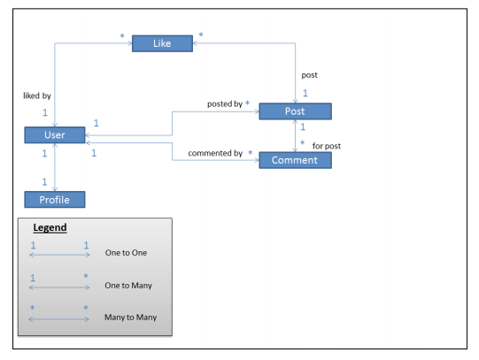

#第三章 模型

这一章，我们将会讨论以下话题：

 - 模型的重要性
 - 类图
 - 模型的结构模式
 - 模型的行为模式
 - 数据库迁移

##M比V和C都重要

在Django里，模型是可以以面向对象的方式与数据库交互的类。一般来说，一个类对应数据库里的一张表，而一个类的属性对应数据库里的一列。你可以用自动生成的API来发出数据库请求。

模型是其他所有组件的基础。一旦你有了模型，你马上就可以使用模型管理器，模型表单和各种各样的通用视图。使用它们中的任何一个你仍然需要一两行代码，不然它们也过于神奇了。

而且，能用到模型的地方远比你想象的多。这主要是因为Django有很多种运行方式。这些方式中包括：

 - 常规的Web“请求-响应"流程
 - Django互动命令行
 - 管理命令
 - 测试脚本
 - 异步任务执行器，比如Celery

在几乎所有这些方式下，模型模块都会被引入(作为`django.setup()`过程的一部分)。因此，尽可能减少你模型里不必要的依赖包以及其他Django模块，比如视图。

总而言之，好好设计你的模型非常重要。下面让我们开始SuperBook模型的设计。

>__午餐研讨会__
>
>_笔者注：SuperBook项目的进度会以这样的形式呈现出来。你可以跳过这样的部分，但那样你就会错过开发Web应用项目能了解到的，经历到的东西，以及一些有趣的事情。_
>
>Steve与他的客户，超级英雄情报与监视局，简称S.H.I.M合作的第一个星期经历比较复杂。整个办公室非常有未来感，但是任何事情都需要层层批准签字。
>
>作为Django开发者领队，Steve花了两天时间搭建好了一个中等规模的服务器，运行着四个虚拟机。但是接下来的一天，这个服务器消失了。旁边一个洗碗机大小的机器人说这个服务器因为安装未经许可的软件被取证部门收走了。不过好在公司的CTO，Hart伸出了援手。他在一个小时内就要回了服务器，里面已安装的软件也完好无损。为了防止以后再发生类似的事情，他还预批准了这台机器上所有的软件安装。
>
>当天下午，Steve和他进行了一场午餐研讨会。Hart穿着一身米色西装和淡蓝色牛仔裤准时到场。尽管他比很多人都要高，还留着光头，他仍然让人觉得非常好相处。他问Steve有没有看看之前60年代为超级英雄建立数据库的尝试。
>
>“啊，有的，Sentinel项目，对吧？”Steve说道。“我看了。那个数据库好像是用入口－属性－值的模型设计的，我觉得这比较反模式。估计那时候他们并不清楚超级英雄有多少属性。”Hart在听到最后一句话的时候几乎打了个寒噤。他用稍低的声音说道，“你是对的，我确实不知道。而且他们当时只给了我两天就要我设计出整个项目。我觉得这个项目有很大的问题。”Steve长大了嘴巴，送到一半的三明治也停在了嘴边。Hart笑到，“这显然不是我的得意项目。一旦超过十亿条记录，在那个数据库上进行的任何数据分析都要花几天。SuperBook只需要几秒钟对吧？”
>
>Steve轻轻点了点头。他一开始也完全没想到会有接近十亿的超级英雄。

##模型分析

这里是定义SuperBook模型的第一步。一般来说，对于早期尝试，我们只把最本质的模型和它们之间的关系表示为一个类图：

我们先不管模型，让我们先从对象的角度来建模。每个用户都有一个用户资料。一个用户可以对数个发布内容作出多次评论。一个__赞__和一个用户/发布内容的组合关联。

我们很推荐像这样为你的模型画一个类图。它们也许不包含所有的属性，但是你可以之后再去关注这些细节。当整个项目都被画上了类图后，要把它们分成应用就会更简单。

这里是画类图时的一些小建议：

 - 方框代表一个实体，最后会变成模型。
 - 在你的概念文档里的名词一般都是实体。
 - 箭头是双向的，在Django里可以表示以下三种关系中的一种：一对一，一对多(以外键方式实现)和多对多。
 - 标出一对多关系的属性应该在实体关系模型(ER-model)中定义出来的。换句话说，标星号的地方即是应该声明外键的地方。

这个类图可以对应到如下的Django代码中(它们可以分布在不同的应用里)：

	class Profile(models.Model):
		user = models.OneToOneField(User)

	class Post(models.Model):
		posted_by = models.ForeignKey(User)

	class Comment(models.Model):
		commented_by = models.ForeignKey(User)
		for_post = models.ForeignKey(Post)

	class Like(models.Model):
		liked_by = models.ForeignKey(User)
		post = models.ForeignKey(Post)

之后我们会看到，我们不再直接调用`User`，而是调用更通用的`settings.AUTH_USER_MODEL`。

##将`models.py`分解成多个文件