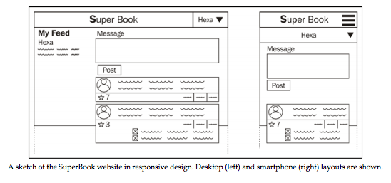

# 第二章 应用设计

这一章，我们将会讲到以下主题：

 - 完整地收集客户需求
 - 创建一个简单的说明文档
 - 简单的HTML样例
 - 如何将工程分成一个个应用
 - 创建新的应用还是使用现有的
 - 开始一项工程前的最佳实践
 - 为什么选择Python 3？
 - 开始SuperBook工程

很多新手创建新工程的方式就是立即开始写代码。这很可能会遇到类似一开始就不正确的假设，设计出之后完全用不上的特性以及完全在浪费时间的情况。即使是在一个非常紧急的项目里，花一些时间从你的客户那儿了解他们的核心需求也很可能会取得你意想不到的效果。管理需求是一个非常关键的值得学习的技能。

## 如何收集客户需求

>Innovation is not about saying yes to everything. It's about saying NO to all but the most crucial features.
>
>
- Steve Jobs

我曾经通过花几天时间仔细倾听客户的需求并给予他们合理的期待值拯救了几个非常糟糕的项目。你只需要拿上铅笔和纸(或者它们的电子版)，整个过程实际上是非常简单但高效的。在你收集客户需求的时候，有以下方面你需要注意一下：

 1. 直接和应用的所有者讨论，即使他不懂技术。
 2. 确保你听全了他们的需求并做好了笔记。
 3. 不要使用类似“模型”这样的技术词汇。使用类似“用户资料”这样的对他们来说更简单更友好的词汇。
 4. 给予他们正确的期待值。如果他们的需求里有技术上不可行或者非常难的点，一定要立即告诉他们。
 5. 草图越多越好。视觉化是人类的天性。网站更需要如此了。大概的线条和图案就足够了，这时候不需要完美。
 6. 将类似用户注册这样的整体流程分成小部分。将多步骤的模块之间用箭头连接起来。
 7. 最后，用故事或者其他易于理解的形式将所有的特性列表过一遍。
 8. 积极地给所有特性标出高，中，低优先级。
 9. 对于新特性一定要持非常保守的态度。
 10. 在这之后开一个小会，将你的笔记与小队里其他人分享，确保没有错误的解读用户需求。

第一个会议将会很长(也许是在工作室一整天，或者分成几个几小时的小会)。慢慢的，随着会议越来越频繁，你可以将它们的时间缩减到半小时到一小时左右。

这些会议的成果一般是一页写满的纸和一些潦草的草图。

在这本书里，我们接受了一个神圣的项目——构建一个名为SuperBook超级英雄的社交网络。这里有一张我们讨论过以后画出来的草图，里面的超级英雄都是随便选的：

## 你会讲故事吗？

那么会议成果里一页写满的纸上到底有什么？写的是简单的关于使用这个网站应该有的感觉。在我参与过的几乎所有项目里，新加入的成员都不会去把所有的书面文件读一遍。这时候如果能给他们一份只有一页纸的可以告诉他们整个网站应该是什么样子的文档，他们一定会非常高兴。

随便你怎么给这个文档起名字——概念文档，市场需求文档，客户体验文档，甚至是史诗级易碎故事录TM(正在申请专利)。这真的不重要。

这篇文档应该更偏重于用户体验，而不是技术和实现的细节。让它尽可能简单有趣。事实上，Joel Spolsky关于这篇文档的第一条规则就是“有趣”。

如果可能的话，描述一个典型的用户，他们遇到的问题，以及这个Web应用是如何帮助他们解决这个问题的。想象一下他们会如何跟他们的朋友介绍自己的体验。尝试把这个写下来。

这里有一个关于SuperBook项目的概念文档：

>__SuperBook概念__
>
>以下的采访发生在未来某天我们启动SuperBook项目以后。在这之前有30分钟的用户测试使用。
>
>__请介绍一下你自己。__
>
>我叫Aksel。我是一只住在纽约城区的灰色松鼠。不过大家都叫我橡果。我的父亲，T.Berry，一位著名的嘻哈明星以前就是那么叫我的。不过我唱歌不够好，不能接管他的事业。
>
>事实上，在我小时候，我有一些盗窃癖。我对坚果过敏。我的其他弟兄们过得很轻松，他们可以在任何公园里活下去。但是我必须在咖啡厅，电影院或者游乐园里做一些即兴表演来维持生存。而且我还得非常仔细地读标签。
>
>__那么，橡果。你觉得为什么你被选中参与这次用户测试呢？__
>
>也许是因为我在一个纽约明星秀里被认为是二线超级英雄。我猜人们觉得会用苹果笔记本的松鼠非常搞笑(采访者：这篇采访是通过在线聊天进行的)。再加上，我还有“松鼠的专注力”(1秒在正常事情上，4分钟在松果和橡果上)。
>
>__根据你看到的，你对SuperBook有什么意见？__
>
>我觉得这真是一个绝妙的点子。我是说，人们到处都能见到超级英雄，但是没人关心他们。他们大多数都比较孤独，不爱社交。SuperBook可以改变这一切。
>
>__那你认为SuperBook的独特之处是什么？__
>
>它一开始就是为我们这样的人设计的。我指的是，在用自己的秘密身份的时候，谁也不知道怎么填“工作和学历”。尽管它们我都没有，但是我可以理解其他有的人。
>
>__你可以简单介绍一下你注意到的特性么？__
>
>当然。我觉得这是一个挺像样的社交网站，你可以：
>
> - 以任何用户名注册(再也没有“请输入你的真实姓名”这样愚蠢的设定了)
> - 粉丝可以在不把他们加为好友的情况下关注他们
> - 发布内容，在上面添加评论，并重新分享它们
> - 给其他用户发布一个私人内容
>
>一切都很简单。不需要花很多精力就能弄明白。
>
>__谢谢你的时间，橡果。__

## HTML样例

在Web应用刚出现的时期，Photoshop和Flash这样的工具被广泛应用于制作像素级完美的样例。不过如今它们已经不再是首选，甚至已经不再被用到了。

获得一个带有平台特色并且在智能手机，平板电脑，笔记本电脑和其他平台上拥有一致的用户体验远比获得一个像素级完美的外观更重要。实际上，现在大多数的设计者都是直接用HTML规划结构。

创建HTML样例比以前高效简单了许多。如果你的网站设计师不在，开发者也可以使用类似Bootstrap或者ZURB这类基础框架来创建一个像样的HTML样例。

创建HTML样例的目标是获得一个网站的真实效果预览。它不仅仅应该和真实的产品长得像，还应该带有应有的用户互动。用可访问的链接和简单的JavaScript写的用户互动让你的静态HTML样例活起来。

一个好的样例让你只需要付出20%的努力就可以获得80%的真实客户体验。

## 设计应用

当你已经差不多想好了你想要创建的项目了，你就可以开始思考要如何通过Django来实现它了。再说一遍，我知道马上就开始写代码非常有吸引力。然而，你只需要花几分钟思考一下整个设计，你就会发现有很多种方法可以解决设计里的问题。

你也可以像__测试驱动设计(Test-driven Design, TDD)__提倡的那样直接开始设计测试样例。我们会在测试章节看到更多TDD的实现方式。

不管最后你选择了哪一条路，你都最好停下来好好想一想——“要实现这个，我有哪些方案可以选？它们之间的取舍是什么？哪一个要素在我们的项目里更重要？最后，哪一个方案最好？”

有经验的Django开发者会从不同的角度去看整个项目。为了坚持DRY原则(或者有时候只是他们太懒了)，他们会想——“我是不是之前见过这个函数？举个例子，这个社交登陆特性能不能用第三方软件包django-all-auth来实现？”

如果他们一定要自己写这个应用，他们会开始考虑各个设计模式，希望能找出最优雅的设计。然而，他们首先需要把整个项目先分解成一个个应用。

## 将项目分解成应用

Django的项目被称作_工程_。一个工程是由好几个_应用_组成的。一个应用是能提供一系列特性的Python软件包。

理想情况下，每一个应用一定要可以重用。你可以按照你的意愿创造随意多的应用。永远不要害怕添加更多的应用或者把现有的应用分解成好多个。一个典型的Django项目会包含15-20个应用。

现在有一个很重要的决定。即我们应该使用第三方Django应用还是自己从头写？第三方应用是已经写好的可以马上投入使用的应用，但是不是你自己写的。大多数的应用安装和配置都非常方便。你可以在几分钟之内就开始使用它们。

而另一方面，自己写应用意味着你需要设计并实现模型，视图，测试样例等等。对于Django来说，这两类应用没有区别。

## 重用还是自己写？

Django的一大优势在于它庞大的第三方应用生态圈。在写这本书的时候，[djangopackages.com](djangopackages.com)上已经有超过2600个软件包了。你也许会发现你的公司或者你个人的库里有更多。当你的项目已经被分解好，你已经知道你需要哪些应用以后，对于每一个应用，你都需要做决定——是自己写还是重用已有的。

安装并使用现有的应用听上去更简单。然而，它并不是一个像它听上去那么简单的方案。让我们来看一些第三方的身份验证应用，并列出我们没有选择它们的原因：

 - __对我们的需求来说过度开发了__：`python-social-auth`支持所有的社交登录，这对我们来说是不必要的
 - __过于限定__： 使用`django-facebook`意味着我们的身份验证只能由那个特定网站能提供
 - __Python依赖包__： `django-allauth`的一个依赖包是`python-openid`，它现在已经不再维护和更新了
 - __非Python依赖包__： 有些软件包可能有Python之外的依赖包，比如Redis或者Node.js，这些会增加部署的难度
 - __无法重用__： 我们自己的很多应用无法被重用，因为它们并没有被设计的易于重用，有的甚至不可被重用。

以上的软件包都不错。只不过他们并不符合我们现在的需求。他们对于另一个项目可能会很有用。对我们来说，Django自带的`auth`应用已经非常好了。

换句话说，你应该因为以下原因选择一个第三方应用：

 - __要正确实现太难了__： 你的模型实例需要组成一个树？用`django-mptt`提供的数据库层面的高效实现
 - __对于这个需求推荐最多的应用__： 虽然这会随着时间改变，但是像是`django-redis`这类应用是它们那类用例里最推荐的应用
 - __框架应该自带的部分__： 一直都非常觉得像`django-model-utils`和`django-extensions`应该是框架自带的
 - __最少的依赖包__： 我的书里一只提倡这一条

所以，我应该重用一个应用来节约时间，还是重新写一个新的？我推荐你在沙盒里尝试一下第三方应用。如果你是一个中级Django开发者，下一部分会告诉你如何在沙盒里尝试软件包。

## 我的应用沙盒

随着时间流逝，你会不断地在几个写着“Django必装软件包”博客之间徘徊。然而，验证一个软件包是不是适合你的项目，最好的办法是做一个原型出来。

即使你已经为开发创建了一个Python虚拟环境，把所有的软件包都试一遍然后再删掉仍然会把你的环境弄乱。我一般都会新建一个“沙盒”环境，单纯为测试这些应用。然后，我会创建一个小的项目来帮助理解它到底有多好用。

如果最后我对这个应用的试运行还比较满意的话，我就会用像Git这样的版本管理工具来把这个应用整合进我的项目里。然后继续编码，跑测试，直到整个新特性都添加完成。最后这个新的分支会被合并到主分支(有时候被称作master)。

## 我们选择了哪些软件包？

为了说明整个过程，我们的SuperBook项目可以被大概分为以下几个应用(非最终版本)：

 - 授权(自带的`django.auth`)： 这个应用负责用户注册，登录和登出
 - 账户(自定义)： 这个应用提供额外的用户资料
 - 发布内容(自定义)： 这个应用负责发布内容和评论相关的功能
 - 评分(自定义)： 这个应用负责管理一个内容获得了多少“赞”(支持或喜欢)
 - 基础表单(`crispy-forms`)： 这个应用会管理表单的布局和样式

这里的每一个应用都要么被标记成从头写(带“自定义”标签)，要么标出我们要使用的第三方Django应用。随着整个项目的进行，这些可能会改变。然而，对于现在来说已经够了。

## 开始项目之前

在准备开发环境的时候，确保你搞定了以下内容：

 - __全新的Python虚拟环境__： Python3有一个`venv`模块，你也可以安装`virtualenv`。它们都可以防止你的全局Python库被污染。
 - __版本控制__： 永远记得使用像Git或Mercurial这样的版本控制工具。它们真的可以拯救你于水火之中。你可以更自省无畏地做出各种改动。
 - __给你的项目选择模板__： Django默认的模板并不是唯一的选择。你可以根据你的需求选择其他的像[`twoscoops`](https://github.com/twoscoops/django-twoscoops-project)或者[`edge`](https://github.com/arocks/edge)的模板。
 - __部署流水线__： 我一般会在更靠后的时间来考虑这个。不过简单的部署过程可以帮助你展示早期进展。我个人比较喜欢Fabric或者Ansible。

## SuperBook - 你的任务，你应该接受它吗？

这本书会通过例子来展示Django的设计模式和最佳实践，因为相信这样是最务实的。为了保持一致，我们所有的例子都会围绕SuperBook这个社交网络项目进行。

SuperBook主要关注的是拥有特殊能力的人们组成的小众的，被忽视的市场。你是整个小组里的一名开发者。同组的还有其他开发者，网站设计师，市场经理和一个项目经理。

这个项目会使用最新版本的Python(版本3.4)和Django(版本1.7)进行开发。鉴于选择Python 3非常有争议，有必要单独为它写一段。

## 为什么选择Python 3？

Python 3从2006年开始开发，2008年12月3日迎来了它的第一个发布版本，Python 3.0。它之所以称为一个向下不兼容的版本，主要原因有——所有的字符串都使用Unicode，迭代器使用更广泛，清理掉了弃用的特性——比如一些旧式风格的类，增加了一些新的语法，比如`nonlocal`语句

Django社区对于Python 3的反应倒是挺复杂的。即使对于语言来说，2到3只是一个小变化(随着时间流逝会变得更小)，对于整个Django代码库要想迁移到新的版本仍然需要做非常多的努力。

2月13日，Django 1.5成为了第一个支持Python 3的版本。开发者们声称，未来的Django将用Python 3开发，但是会保持向下兼容Python 2。

本书选择Python 3的原因有：

 - __更好的语法__： Python 3带走了很多难看的语法，比如`izip`，`xrange`和`__unicode__`，取而代之的是更简洁明了的`zip`，`range`和`__str__`。
 - __充足的第三方支持__： 在前200第三方库里，超过80%的库都支持Python 3.
 - __没有遗留代码__： 因为这是一个新项目，我们并不需要解决遗留代码对旧语言的依赖。
 - __现代平台的默认规范__： 在Arch Linux里，Python 3已经是默认的Python解释器版本了。Ubuntu和Fedora也会在未来的发布版本里完成切换。
 - __这并不难__： 对于Django开发者来说，改动并不大，几分钟就可以学会它们。

最后一条很重要。即使你是Python 2使用者，你读这本书也不会有任何问题。附录A列出了这些改动。你只需要在样例代码上做非常少的改动。

## 开始项目

这一部分包括SuperBook项目的安装指南，这个项目包括所有我们这本书里用到的样例代码。查看项目里的README文件来了解最新的安装指南。这里推荐你先创建一个全新的目录，superbook，来存放虚拟环境和项目源代码。

理想情况下，每一个Django项目应该有自己独立的虚拟环境。这样安装，更新和删除软件包会更容易，也不会影响到其他的应用。Python 3.4里，内置的`venv`模块就非常好用，因为它默认安装了`pip`：

	$ python3 -m venv sbvne
	$ source sbenv/bin/activate
	$ export PATH="`pwd`/sbenv/local/bin:$PATH"

这些命令在基于Unix的操作系统里应该可以直接使用。关于在其他操作系统里安装的步骤，请参考Github仓库:[https://github.com/DjangoPatternsBook/superbook](https://github.com/DjangoPatternsBook/superbook)里的README文件。在第一行里，我们通过执行`python3`来调用Python 3.4，请确认这在你使用的操作系统版本里是正确的。

某些情况可能不需要最后一行的`export`。如果你执行`pip freeze`看到的是系统的软件包，你就需要执行这一行。

>开始你的Django项目之前，创建一个全新的虚拟环境。

下一步，从GitHub上克隆样例项目并安装依赖包：

	$ git clone https://github.com/DjangoPatternsBook/superbook.git
	$ cd superbook
	$ pip install -r requirements.txt

如果你想要看看实现好的SuperBook网站，执行`migrate`并启动服务器就可以：

	$ cd final
	$ python manage.py migrate
	$ python manage.py createsuperuser
	$ python manage.py runserver

在Django 1.7里，`migrate`命令取代了`syncdb`命令。我们也需要显式地创建一个超级用户来访问admin网站。

你可以访问`http://127.0.0.1:8000`或者你在你的终端里看到的URL来试用整个网站。

## 总结

新手往往忽视了收集所有需求的重要性。与此同时，不要陷入各种细节的深潭也是非常重要的，因为编程的本质其实是一个探索的过程。最成功的项目一定在开发前的准备工作上花了足够的时间，从而选择了收益最高的方案。

我们讨论了设计应用的很多方面，比如创建一个带有互动的样例，将可重用的模块分离成独立的应用。我们还讨论了如何设置好我们的样例项目——SuperBook。

下一章里，我们会看看Django几个组件的实现细节，学习他们用到的设计模式和最佳实践。